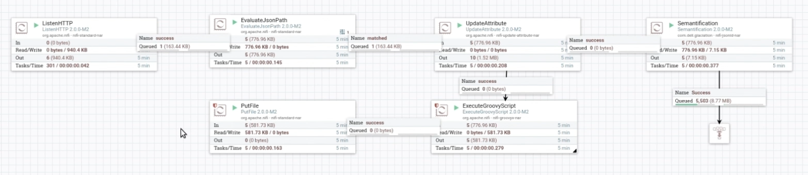
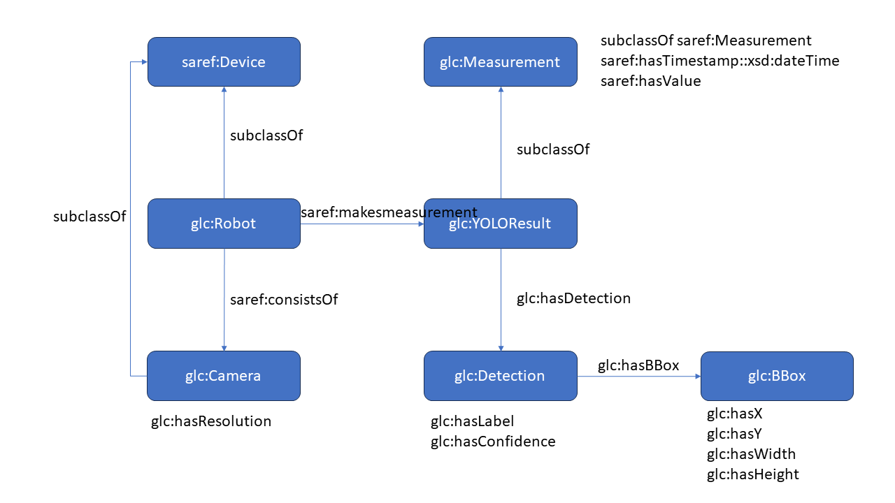

# UC2: Data-driven energy-efficient manufacturing

```python
.
├── custom		# Java code for custom processor 
├── DAYTON.ttl	# dummy data for triple store
├── fuseki-configuration  # fuseki configuration file
├── input		# dummpy input data for data flow test
├── NiFi_Flow.json	# exported NiFi flow file
├── nifi-jsonld-nar-2.0.0-M2.nar # created custom processor
├── README.md
└── simulate.py	# simulation code for workload genration
```


## Introduction

This repository contains code and file related to UC2 data collection and workload generation.

* Robot navigates a manufacturing site, using Computer Vision tools (YOLO) to generate object detection results
* YOLO results (JSON files) are streamed into GLACIATION platform, more specifically, Apache NiFi data flow management tool running on the platform
* Apache NiFi has a HTTPListening component to take the input and store the results into DKG
* **Example Workload**: Construct images labeled with detected humans from stored results in DKG for manual evaluation 


## Requriements

* Apache NiFi 2.0.0-M2
* Custom processor needs to be in ```extensions``` folder


## Apache NiFi data flow

* ```ListenHTTP``` is listening HTTP requests (e.g., sending JSON files via HTTP from robots)
* ```ExecuteGroovyScript``` decode base64 encoded images and store in another location specified in ```PutFile```
* ```Semantification``` is a custom processor for semantifying the YOLO results according to the UC2 ontology below, and store the information into Apache Jena instance (DKG).

## UC2 ontology for storing YOLO results

